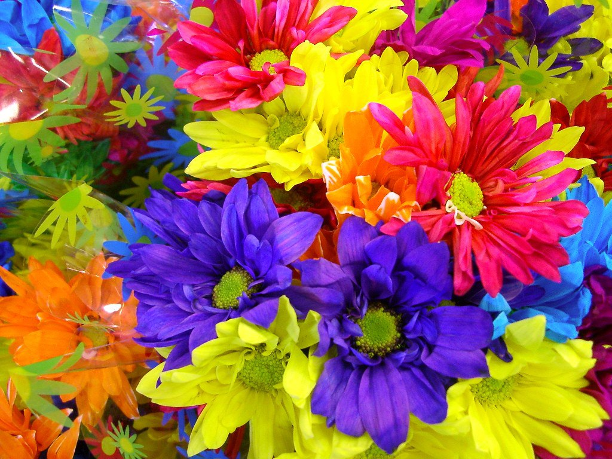

Plug-in for GIMP 2.10.

Filter divides an image into N user-specified random areas and recolours each of them with its dominant colour. The accuracy of the dominant colour calculation is determined by second parameter K, which sets number of colour buckets.

<table>
  <tr>
    <td></td>
    <td></td>
  </tr>
  <tr>
    <td></td>
    <td></td>
  </tr>
  <tr>
    <td></td>
    <td></td>
  </tr>
</table>
